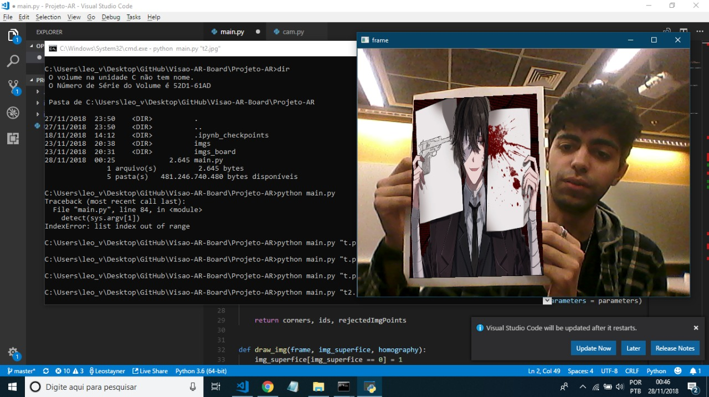

# AR Board - Projeto Visão Computacional
Alunos: [Martim José](https://github.com/martimfj) e [Leonardo Medeiros](https://github.com/Leostayner)

## Introdução
Realidade Aumentada (RA) ou Augmented Reality (AR) são aplicações que adicionam experiências sensoriais (visão, audição, tato, etc) do mundo virtual ao mundo real. Neste projeto foi implementado uma aplicação que utiliza de marcadores para indicar uma superfície na qual é renderizada uma imagem à escolha do usuário.

## Como funciona
Os marcadores utilizados são chamaos tabuleiros ChArUco (fusão de tabuleiro de Xadrez com marcadores ArUco). Eles contém características que permitem a fácil detecção dos cantos por meio dos algoritmos implementados na biblioteca `cv2.aruco` disponível somente na versão *contrib* do *OpenCV*.

Sabendo a localização de cada canto dos marcadores, é possível renderizar uma imagem pra ocupar o lugar do tabuleiro ChArUco por meio da multiplicação da imagem por uma matriz Homografia. A matriz homografia é calculada a partir de uma imagem de referência do tabuleiro, pelos cantos obtidos no frame.

## Resultado


## Como utilizar
Para executar esse programa instale as dependências via:

```$ sudo pip install -r requirements.txt``` 

E rode passando como argumento o nome da imagem a ser renderizada:

```$ python main.py "t.png"```

